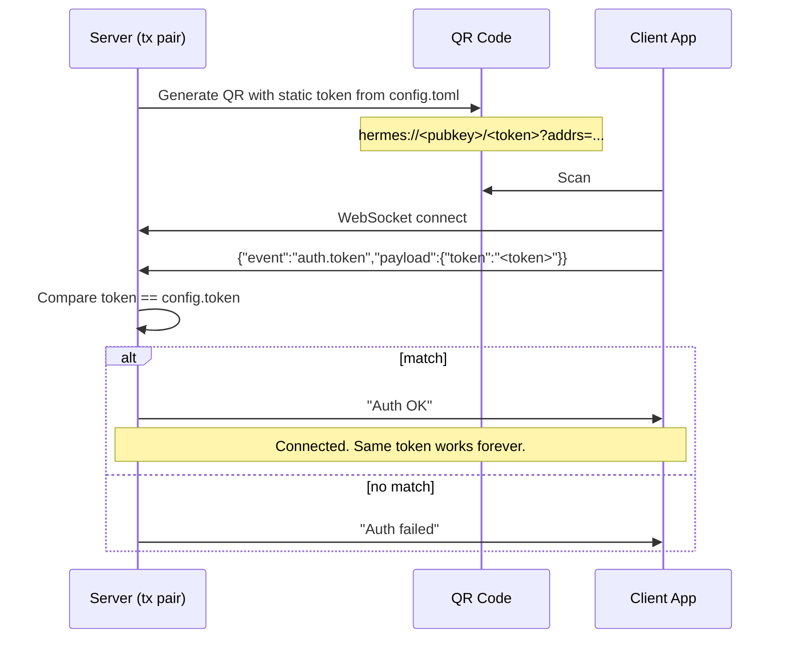
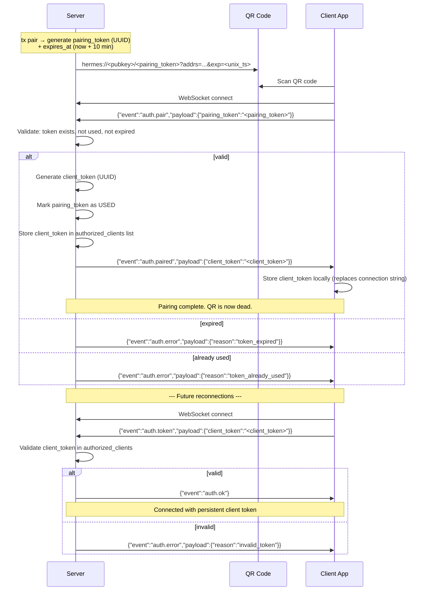

# Initial Token Pairing: Single-Use QR with Token Rotation + Expiry

## Problem

The current QR code contains a static token from `config.toml`. Anyone who photographs or intercepts the QR code can connect to the server at any time — the token never expires and never rotates. The QR code is reusable forever.

## Goal

Make QR codes single-use: after one client successfully pairs, the pairing token is consumed. Add a time-based expiry window so unclaimed QR codes also become invalid after a short period.

## Current Flow



## Proposed Flow (Approach 2: Pairing Token + Time-Based Expiry)



## Design Details

### Server Changes

#### 1. Pairing Token Store (new)

Replace the single static `config.token` with a **pairing token store**:

```
pairing_tokens: HashMap<String, PairingToken>
```

```rust
struct PairingToken {
    token: String,       // UUID
    created_at: u64,     // unix timestamp
    expires_at: u64,     // unix timestamp (created_at + TTL)
    used: bool,          // consumed by a client?
    used_by: Option<String>, // client_id that consumed it
}
```

- `tx pair` generates a new entry with TTL (default: 10 minutes)
- TTL is configurable via CLI flag: `tx pair --ttl 300` (seconds)
- Expired/used tokens are cleaned up periodically or on next `tx pair`

#### 2. Authorized Clients Store (new)

Track paired clients persistently:

```
authorized_clients: HashMap<String, AuthorizedClient>
```

```rust
struct AuthorizedClient {
    client_id: String,       // UUID, unique per client
    client_token: String,    // UUID, the bearer token for reconnection
    paired_at: u64,          // unix timestamp
    last_seen: Option<u64>,  // updated on each connection
    label: Option<String>,   // optional human-friendly name
}
```

- Stored in a JSON file or SQLite alongside existing PKM data
- No limit on number of paired clients (multiple devices supported)
- `tx clients list` — show paired clients
- `tx clients revoke <client_id>` — remove a client's authorization

#### 3. WebSocket Auth Handler Changes

The auth handler in `ws/mod.rs` needs to distinguish two auth flows:

- **`auth.pair`** — first-time pairing with a pairing token
  1. Look up pairing token in store
  2. Check not expired (`now < expires_at`)
  3. Check not used (`used == false`)
  4. Generate `client_id` + `client_token`
  5. Store in `authorized_clients`
  6. Mark pairing token as used
  7. Send `auth.paired` response with `client_token`

- **`auth.token`** — reconnection with a client token
  1. Look up `client_token` in `authorized_clients`
  2. If valid, send `auth.ok`, update `last_seen`
  3. If invalid, send `auth.error`

#### 4. QR Code Format Change

Current: `hermes://<pubkey>/<token>?addrs=...`
New:     `hermes://<pubkey>/<pairing_token>?addrs=...&exp=<unix_timestamp>`

The `exp` parameter lets the client show "QR expired" locally without needing to hit the server.

### Client Changes

#### 1. ConnectionManager — Two Auth Modes

Detect whether we have a stored `client_token`:

- **No client_token stored** (first time): parse QR, send `auth.pair` with `pairing_token`
- **client_token exists** (reconnection): send `auth.token` with `client_token`

#### 2. Storage

Replace storing the raw connection string with structured data:

```
client_token: String       // the rotated bearer token
server_addresses: List<String>  // ws:// or wss:// URLs
```

On successful pairing (`auth.paired` received), store the `client_token` and server addresses. Discard the original connection string / pairing token.

#### 3. WebSocketClient — Handle New Events

New events to handle:
- `auth.paired` — extract and store `client_token`, transition to Connected
- `auth.error` — show reason to user (expired, already used, invalid)
- `auth.ok` — transition to Connected (replaces current "Auth OK" string)

#### 4. QR Expiry Check (optional UX)

If the scanned QR has an `exp` parameter and `now > exp`, show a message: "This QR code has expired. Please generate a new one on the server." — without attempting to connect.

### Migration / Backwards Compatibility

- Existing clients with a stored `connection_string` using the old static token will fail to auth after upgrade.
- **Migration path**: On first launch after upgrade, if old `connection_string` exists but no `client_token`, prompt user to re-scan a new QR code.
- The server should initially support BOTH the old `config.token` auth AND the new pairing flow during a transition period, controlled by a config flag `legacy_auth: bool`.

## Files to Modify

### Server (Rust)
| File | Change |
|------|--------|
| `server/src/auth.rs` | Add `PairingToken`, `AuthorizedClient` structs, validation logic |
| `server/src/ws/mod.rs` | Two auth flows (`auth.pair` vs `auth.token`), new event responses |
| `server/src/config.rs` | Add `legacy_auth` flag, `pairing_ttl_secs` |
| `server/src/bin/tx.rs` | `tx pair` generates time-limited tokens; add `tx clients list/revoke` |
| `server/src/pairing_store.rs` | **New file** — pairing token + authorized client persistence |

### Client (Kotlin Multiplatform)
| File | Change |
|------|--------|
| `app/src/commonMain/.../ConnectionManager.kt` | Two auth modes, store client_token |
| `app/src/commonMain/.../WebSocketClient.kt` | Handle `auth.paired`, `auth.ok`, `auth.error` events |
| `app/src/commonMain/.../ui/App.kt` | Migration prompt, expiry UX |
| `app/src/androidMain/.../Storage.kt` | Store structured client data |
| `app/src/jsMain/.../Storage.kt` | Store structured client data |

## Testing Plan

1. **Happy path**: `tx pair` → scan QR → client gets `client_token` → disconnect → reconnect with `client_token` → works
2. **QR reuse blocked**: Scan same QR from a second device → `token_already_used` error
3. **QR expiry**: Wait past TTL → scan → `token_expired` error
4. **Multiple clients**: Pair device A, pair device B (new QR) → both can connect simultaneously
5. **Client revocation**: `tx clients revoke` → revoked client can no longer connect
6. **Reconnection resilience**: Kill server → restart → client reconnects with stored `client_token`

---

## Future: Asymmetric Key Pairing (Approach 3)

The current design uses bearer tokens — if a `client_token` is intercepted, it can be replayed. A future upgrade can eliminate bearer tokens entirely using asymmetric cryptography:

### Concept

1. **Server generates a key pair** at setup. The QR code already has a `pubkey` field (currently `mock_pubkey`) — this would carry the real server public key.

2. **Client generates a key pair** during pairing. Instead of receiving a `client_token`, the client sends its **public key** to the server during the `auth.pair` exchange.

3. **Future auth uses signed challenges**:
   ```
   Client → Server:  "I am client_id X"
   Server → Client:  "Sign this nonce: <random_bytes>"
   Client → Server:  sign(nonce, client_private_key)
   Server:           verify(signature, stored_client_public_key)
   ```

4. **No replayable tokens exist** after pairing. Even if someone intercepts the WebSocket traffic, they cannot authenticate without the client's private key.

### What This Adds Over Approach 2

| Aspect | Approach 2 (Token Rotation) | Approach 3 (Asymmetric Keys) |
|--------|---------------------------|------------------------------|
| QR single-use | Yes | Yes |
| QR expiry | Yes | Yes |
| Replay attacks | Vulnerable (bearer token) | Immune (challenge-response) |
| Man-in-the-middle | Vulnerable without TLS | Can pin server pubkey from QR |
| Key storage | Simple string | Needs secure keystore (Android Keystore / Web Crypto API) |
| Complexity | Low | High |
| Dependencies | None | Crypto libraries per platform |

### Prerequisites for Approach 3

- Replace `mock_pubkey` in `tx.rs` with real server key generation
- Platform `expect/actual` for secure key storage (Android Keystore, Web Crypto API)
- Choose a signing algorithm (Ed25519 recommended — fast, small keys, widely supported)
- Add crypto dependencies to KMP build (`libsodium` or platform-native APIs)

### Migration Path from Approach 2 → 3

Approach 2 is designed to be forward-compatible:
- The `auth.pair` / `auth.token` event structure can be extended with key exchange fields
- The `authorized_clients` store can add a `public_key` column
- Clients can be re-paired with key exchange without changing the overall flow
- The pairing token + expiry mechanism remains the same — only the post-pairing auth changes
