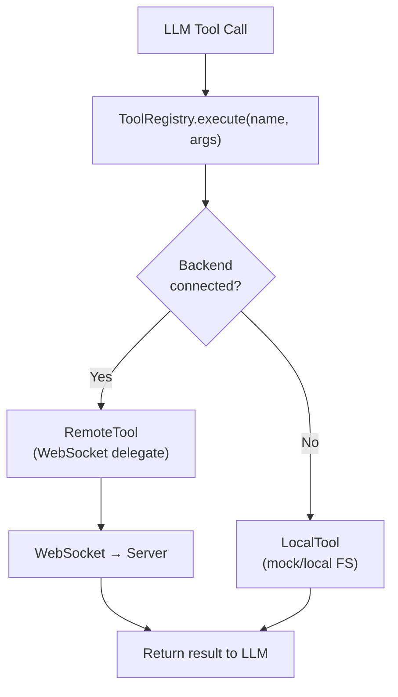
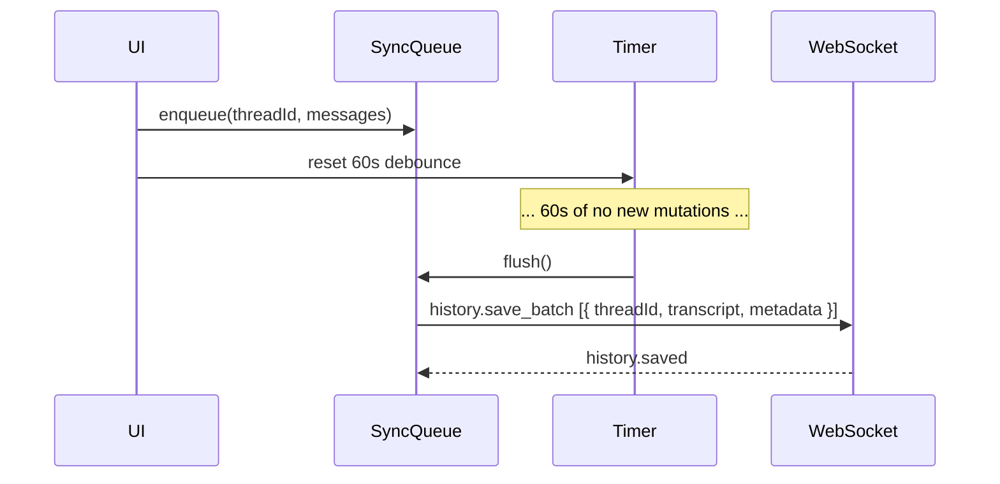

# Tools Expansion + History Persistence with Backend Delegation

## Goal

Expand the tool set to cover the full operational surface from `obsidian-hermes` and the project specs. Introduce a **frontend-first delegation model**: tools run locally when no backend is connected, and automatically delegate to the backend over WebSocket when connected. Apply the same pattern to history/conversation logging — with a **throttled bulk-sync** to avoid network chatter.

## Current State

**Tools already implemented:**

| Tool | Mock | Remote |
|------|------|--------|
| `read_file` | ✅ | ✅ (`kb.get`) |
| `create_file` | ✅ | ✅ (`kb.create`) |
| `search_keyword` | ✅ | ✅ (`kb.search`) |
| `context` | ✅ | — |
| `system_info` | — | ✅ (`system.info`) |

**History/logging:** In-memory `EventLogger` + per-thread local storage save (1s debounce). No file-based persistence, no backend sync.

---

## Full Target Tool Set

### File Operations
| Tool | WS Event | Description |
|------|----------|-------------|
| `read_file` | `kb.get` | Read file by path |
| `create_file` | `kb.create` | Create new file |
| `update_file` | `kb.update` | Replace entire file content |
| `edit_file` | `kb.edit` | Line-range or pattern-based edit |
| `delete_file` | `kb.delete` | Delete file |
| `rename_file` | `kb.rename` | Rename/move a file |
| `move_file` | `kb.move` | Move file to different folder |

### Directory Operations
| Tool | WS Event | Description |
|------|----------|-------------|
| `list_directory` | `kb.list` | List directory contents (shallow) |
| `list_vault_files` | `kb.list_all` | List all vault files, optional filter |
| `get_folder_tree` | `kb.tree` | Recursive folder tree |
| `create_directory` | `kb.mkdir` | Create directory |

### Search
| Tool | WS Event | Description |
|------|----------|-------------|
| `search_keyword` | `kb.search` | FTS keyword search |
| `search_regexp` | `kb.search_re` | Regex search across vault |
| `search_replace_file` | `kb.sr_file` | Search+replace in one file |
| `search_replace_global` | `kb.sr_global` | Search+replace across vault |
| `read_notes` | `kb.read_notes` | Read array of paths, optional depth=1 resolves wikilinks |

### Conversation / Thread Management
| Tool | WS Event | Description |
|------|----------|-------------|
| `context` | `system.info` | Current vault state, active thread, recent files |
| `topic_switch` | `thread.archive_segment` | Summarize + archive current segment, start fresh sub-topic |
| `end_conversation` | `thread.close` | Gracefully close + archive thread, clear active context |

### History Persistence
| Tool | WS Event | Description |
|------|----------|-------------|
| `history_persist` | `history.save` | Save thread transcript to vault history files |

> `internet_search` and `generate_image_from_context` are deferred to IT-4 (Research iteration).

---

## Frontend-First Delegation Architecture



Each tool is implemented as a **DelegatingTool** wrapper:

```kotlin
class DelegatingTool(
    override val declaration: FunctionDeclaration,
    private val localImpl: Tool,
    private val remoteImpl: Tool,
    private val connectionManager: ConnectionManager
) : Tool {
    override suspend fun execute(args: JsonObject): JsonObject {
        return if (connectionManager.isConnected()) {
            remoteImpl.execute(args)
        } else {
            localImpl.execute(args)
        }
    }
}
```

The `ToolRegistry` is constructed once at app startup with all delegating tools. Registration happens in a `buildToolRegistry(connectionManager)` factory function, not inline in the UI composable.

### Tool Organization

```
app/src/commonMain/kotlin/com/hermes/tools/
  ToolRegistry.kt           (existing — minor changes)
  DelegatingTool.kt         (new)
  ToolFactory.kt            (new — buildToolRegistry())
  local/
    LocalFilesystemTools.kt (rename from MockFilesystemTools.kt + expand)
    LocalHistoryTools.kt    (new)
    LocalThreadTools.kt     (new)
  remote/
    RemoteFileTools.kt      (expand from RemoteTools.kt)
    RemoteSearchTools.kt    (new)
    RemoteThreadTools.kt    (new)
    RemoteHistoryTools.kt   (new)
```

---

## History Logging: Frontend-First + Throttled Sync

### Design

1. **Always write locally first.** Every thread's message history is serialized to `localStorage` (web) / SharedPreferences (Android) immediately on change, as it does today.

2. **If backend connected, enqueue for sync.** Mutations (new messages, thread close) are added to a `SyncQueue`.

3. **Throttle: minimum 60 seconds between flushes.** The queue only flushes after 60 seconds of _no new mutations_ (trailing debounce), OR when the app goes to background/closes, OR on `end_conversation`.

4. **Bulk sync on flush.** All queued history writes are batched into a single `history.save_batch` event — one round-trip.



### History File Format (written to vault by server)

```
{vault}/robot_memory/threads/{YYYY}/{MM}/{YYYY-MM-DD-topic-slug}.md
```

Frontmatter fields: `date`, `thread_id`, `persona`, `summary` (LLM-generated on close).

Index files:
```
{vault}/robot_memory/history-by-date.md   — year/month headings, wiki-linked thread entries
{vault}/robot_memory/history-by-topic.md  — topic headings (future)
```

Index update is handled server-side when it receives `history.save` or `thread.close`.

### SyncQueue Implementation

```
app/src/commonMain/kotlin/com/hermes/history/
  SyncQueue.kt         (new — queue + 60s debounce timer)
  HistorySerializer.kt (new — ChatMessage[] → markdown transcript)
  LocalHistory.kt      (new — localStorage persistence, no WS)
```

---

## New WebSocket Events

### Client → Server

| Event | Payload | Notes |
|-------|---------|-------|
| `kb.update` | `{ path, content }` | Replace file |
| `kb.edit` | `{ path, start_line, end_line, new_content }` | Patch file |
| `kb.delete` | `{ path }` | Delete file |
| `kb.rename` | `{ path, new_path }` | Rename |
| `kb.move` | `{ path, dest_dir }` | Move |
| `kb.list` | `{ path }` | Shallow list |
| `kb.list_all` | `{ filter? }` | Full vault list |
| `kb.tree` | `{ path? }` | Folder tree |
| `kb.mkdir` | `{ path }` | Create dir |
| `kb.search_re` | `{ pattern, flags? }` | Regex search |
| `kb.sr_file` | `{ path, search, replace }` | SR in file |
| `kb.sr_global` | `{ search, replace, glob? }` | SR globally |
| `kb.read_notes` | `{ paths: string[], depth: 0\|1 }` | Read multi |
| `thread.archive_segment` | `{ thread_id, summary? }` | Topic switch |
| `thread.close` | `{ thread_id }` | End conversation |
| `history.save_batch` | `{ items: HistoryItem[] }` | Bulk sync |

### Server → Client

| Event | Notes |
|-------|-------|
| `kb.updated` | Ack for update/edit/delete/rename/move |
| `kb.list.result` | Shallow list result |
| `kb.list_all.result` | Full vault result |
| `kb.tree.result` | Folder tree result |
| `kb.search_re.result` | Regex results |
| `kb.sr.result` | Search-replace result + count |
| `kb.read_notes.result` | `{ files: { [path]: content } }` |
| `thread.archived` | Segment archived OK |
| `thread.closed` | Thread closed OK |
| `history.saved` | Batch written to vault |

---

## Local (Mock) Implementations

All new tools need a local fallback that works against the in-memory `MockFilesystem`. This keeps the app fully usable without a server and keeps Playwright tests server-free.

Local implementations that are no-ops or trivially implementable in-memory:
- `update_file` → `mockFs[path] = content`
- `delete_file` → `mockFs.remove(path)`
- `rename_file` / `move_file` → `mockFs[newPath] = mockFs.remove(oldPath)`
- `list_directory` / `list_vault_files` → filter `mockFs.keys`
- `get_folder_tree` → build tree from `mockFs.keys`
- `create_directory` → no-op (mock FS is flat)
- `search_regexp` → iterate mockFs, apply regex
- `search_replace_*` → string ops on mockFs values
- `read_notes` → read multiple keys from mockFs, depth ignored
- `topic_switch` / `end_conversation` → clear active message buffer, update thread state
- `history_persist` → write to localStorage only

---

## Server-Side Changes

### New Rust handlers (`server/src/ws/`)

Add handlers for all new `kb.*` events delegating to PKM layer:

```
server/src/ws/kb_handlers.rs  — expand with update, edit, delete, rename, move, list, tree, mkdir, search_re, sr, read_notes
server/src/ws/thread_handlers.rs  (new) — archive_segment, close
server/src/ws/history_handlers.rs (new) — save_batch, update index files
```

### PKM Layer (`server/src/pkm/`)

- `fs.rs` (new or expand) — file CRUD, rename, move, mkdir, folder tree
- `search.rs` (new or expand) — regex search, search-replace
- `history.rs` (new) — write transcript .md files, update index files

---

## Implementation Phases

### Phase 1 — Delegating Tool Architecture
- [x] 1. Create `DelegatingTool.kt`
- [x] 2. Create `ToolFactory.kt` — wire all existing tools as delegating
- [x] 3. Move tool construction out of `App.kt` composable
- [x] 4. No new tools yet — just refactor existing 4 into the new pattern
- [x] 5. Playwright: verify existing tool tests still pass

### Phase 2 — File Operation Tools (client + server)
- [x] 1. Implement local: `update_file`, `edit_file`, `delete_file`, `rename_file`, `move_file`
- [x] 2. Implement remote: `kb.update`, `kb.edit`, `kb.delete`, `kb.rename`, `kb.move`
- [x] 3. Add server handlers
- [x] 4. Add Playwright tests for each

### Phase 3 — Directory + Search Tools (client + server)
- [x] 1. Implement local: `list_directory`, `list_vault_files`, `get_folder_tree`, `create_directory`
- [x] 2. Implement local: `search_regexp`, `search_replace_file`, `search_replace_global`, `read_notes`
- [x] 3. Implement remote equivalents + server handlers
- [x] 4. Playwright tests

### Phase 4 — Thread Tools (client + server)
- [x] 1. Implement `topic_switch` (local: clear buffer + save segment; remote: `thread.archive_segment`)
- [x] 2. Implement `end_conversation` (local: close + save; remote: `thread.close`)
- [x] 3. Server: archive segment → write .md file to vault
- [x] 4. Playwright tests

### Phase 5 — History Persistence + Throttled Sync
- [x] 1. Implement `SyncQueue` with 60s trailing debounce
- [x] 2. Implement `HistorySerializer` (messages → markdown transcript)
- [x] 3. Implement `LocalHistory` (localStorage write)
- [x] 4. Implement `history.save_batch` WS event on server
- [x] 5. Server writes transcript to vault + updates index files
- [x] 6. Flush on `end_conversation` (bypass debounce)
- [x] 7. Playwright tests: verify history file written after 60s

---

## Files to Modify / Create

### Client (Kotlin Multiplatform)

| File | Change |
|------|--------|
| `app/src/commonMain/.../tools/DelegatingTool.kt` | **New** — delegation wrapper |
| `app/src/commonMain/.../tools/ToolFactory.kt` | **New** — `buildToolRegistry(connectionManager)` |
| `app/src/commonMain/.../tools/local/LocalFilesystemTools.kt` | **Rename + expand** from MockFilesystemTools.kt |
| `app/src/commonMain/.../tools/local/LocalHistoryTools.kt` | **New** — localStorage history write |
| `app/src/commonMain/.../tools/local/LocalThreadTools.kt` | **New** — topic_switch, end_conversation local |
| `app/src/commonMain/.../tools/remote/RemoteFileTools.kt` | **Expand** from RemoteTools.kt |
| `app/src/commonMain/.../tools/remote/RemoteSearchTools.kt` | **New** |
| `app/src/commonMain/.../tools/remote/RemoteThreadTools.kt` | **New** |
| `app/src/commonMain/.../tools/remote/RemoteHistoryTools.kt` | **New** |
| `app/src/commonMain/.../history/SyncQueue.kt` | **New** — queue + 60s debounce |
| `app/src/commonMain/.../history/HistorySerializer.kt` | **New** — messages → markdown |
| `app/src/commonMain/.../history/LocalHistory.kt` | **New** — localStorage write |
| `app/src/commonMain/.../ui/App.kt` | Wire `buildToolRegistry()`, wire `SyncQueue` |

### Server (Rust)

| File | Change |
|------|--------|
| `server/src/ws/kb_handlers.rs` | **Expand** — add update, edit, delete, rename, move, list, tree, mkdir, search_re, sr, read_notes |
| `server/src/ws/thread_handlers.rs` | **New** — archive_segment, close |
| `server/src/ws/history_handlers.rs` | **New** — save_batch, index update |
| `server/src/pkm/fs.rs` | **New/expand** — CRUD, rename, move, tree, mkdir |
| `server/src/pkm/search.rs` | **New/expand** — regex, search-replace |
| `server/src/pkm/history.rs` | **New** — transcript write, index update |

---

## Testing Plan

1. **Local tools work without server**: disconnect → all 20 tools callable → correct results from mock FS
2. **Delegation switches on connect**: connect server → same tool calls go through WebSocket
3. **Delegation switches on disconnect**: kill server mid-session → tools fall back to local silently
4. **History sync throttle**: make N edits in < 60s → no WS flush → wait 60s → single `history.save_batch` with all edits
5. **History flush on end_conversation**: `end_conversation` tool call → immediate flush regardless of timer
6. **Bulk sync**: batch contains correct thread transcript in markdown format
7. **Server writes history**: after flush → vault has `robot_memory/threads/YYYY/MM/…md` file
8. **Index updated**: `history-by-date.md` has new entry after thread close
9. **topic_switch**: local → clears message buffer, saves segment; remote → `thread.archive_segment` ack'd
